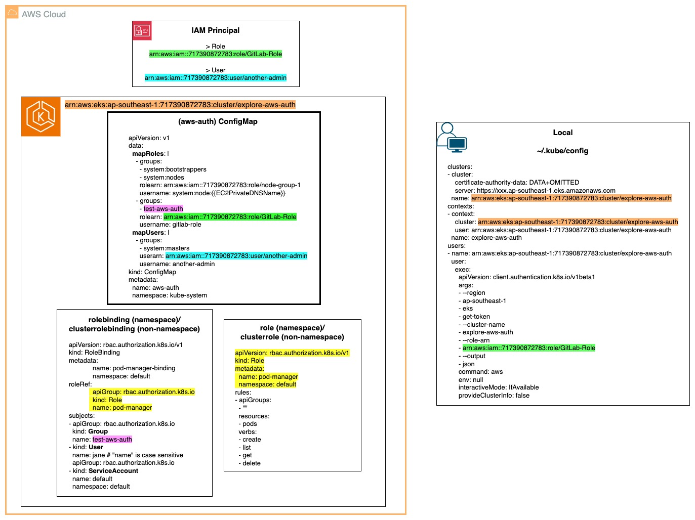

### Check out my article on "Demystifying AWS EKS's aws-auth ConfigMap: A Comprehensive Guide"
https://medium.com/@kennyangjy/

---
> *Caution:* Cost will be involved in creating these resources. For more information, do visit the relavent resource pricing pages as it differs from region to region.
- https://aws.amazon.com/eks/pricing/
- https://aws.amazon.com/ec2/pricing/
---

### To provision the resources in this repository:
1. `git clone https://github.com/Kenny-AngJY/demystifying-aws-auth.git`
2. If you have an exisiting KMS Customer-managed key in your account and wish to use it to encrypt the secrets in EKS, create a *var.tfvars* file and define the KMS key ARN there. 
 *kms_key_arn = "arn:aws:kms:..."*

3. `terraform init`
4. Following the article, we do not want to create the managed node group yet, simply run `terraform plan` or 
 `terraform plan -var-file=var.tfvars` if you have a KMS key ARN defined.
 There should be 20 resources to be created. If KMS key ARN is defined, 22 resources.
5. `terraform apply` or `terraform apply -var-file=var.tfvars`
 As no backend is defined, the default backend will be local. 
 Do wait for 5-10 minutes for the resources to be provisioned.

6. When you want to create the managed node group, simply add a `-var "create_node_group=true"` to the command you have used above. 
 E.g. `terraform apply -var "create_node_group=true"`
 There should be 5 resources to be created.
 Do wait for 5 minutes for the resources to be provisioned.

### Clean-up
1. `terraform destroy`
